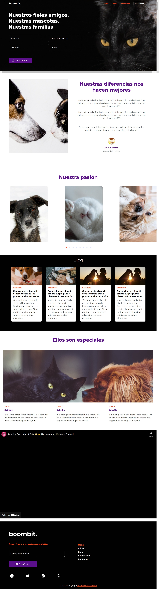

# Boombit - Landing

### The challenge

Tu reto es construir este landing y conseguir que se parezca lo más posible al
diseño.

Puedes utilizar las herramientas que quieras para ayudarte a completar el reto
se recomienda usar: React, Tailwind, Bootstrap o cualquier stack que desees.

Tus usuarios deben ser capaces de:

- Ver el diseño óptimo del sitio en función del tamaño de la pantalla de su
  dispositivo
- Ver el estado de los elementos interactivos de la página al pasar el ratón por
  encima de ellos.
- Navegar por el slider utilizando el ratón/trackpad o el teclado
- En el archivo style-guide.md es donde encontrarás los colores, las fuentes,
  etc.

### Screenshot

Agrega una captura de pantalla de tu solución. La forma más fácil de hacerlo es
utilizar Firefox para ver su proyecto, hacer clic con el botón derecho del ratón
en la página y seleccionar "Hacer una captura de pantalla". Puedes elegir una
captura de pantalla de altura completa o una recortada en función de la longitud
de la página. Si es muy larga, lo mejor es recortarla.

### Links

Para este ejercicio solicitamos el uso de Git, GitHub y GithubPage, debes crear
un repositorio de github con el nombre boombit-room-page y en él debe tener al
menos dos ramas una principal y una de desarrollo. Haz uso del flijo de git para
manejar las versiones del proyecto y recuerda actualizar la rama principal al
entregar la solución.

- Solution URL: [https://github.com/rodrigo-antonio-vargas-abarca/boombit-room-page]
- Live Site URL: [https://62d51a8d4624d40b871543f5--boombit-room-site-rava.netlify.app/]

Completa este archivo el archivo Readme con esta información basada en tu
solución:

## My process
-Creación de repositorio base en GitHub
-Creación de ramas principales (master, develop, release)
-Clonación de repositorio
-Creación de proyecto base React
-Instalación de librerías base (GithubPages, Bootstrap, font awesome, jquery, carousel)
-Customización e inclusión de variables Bootstrap para el manejo de colores del sitio en hoja de estilos .sass
-Transpilar archivo sass a css para incluir las variables y estilos customizados
-Creación de rama feature para cada componente de la página (navbar, footer, contactos, home...)
-Creación de componente, importación de librerías requeridas y customización de estilos en cada feature para componente
-Merge de ramas features hacia rama de desarrollo
-Merge de rama desarrollo hacia rama release en cada versión
-Merge de rama release hacia rama master
-Hosting de la aplicación de las versiones en producción

### Built with

- Semantic HTML5 markup
- CSS custom properties
- Flexbox
- CSS Grid
- Mobile-first workflow
- [FontAwesome](https://fontawesome.com/v5/docs/) - Icons
- [React](https://reactjs.org/) - JS library
- [JQuery](https://jquery.com/) - JS library
- [ReactBootstrap](https://react-bootstrap.github.io/) - For styles
